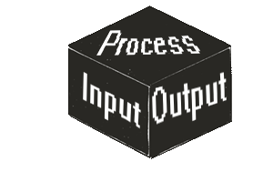

# **Compilador de aprendizaje**
## Un compilador simple de una variación de java


## **Instalación** 
Para poder hacer uso de este proyecto es necesario tener instalado `Node` para poder hacer uso del JavaScript de la aplicación. Para empezar, clone el repositorio con:

```bash
git clone https://github.com/dani0105/compilador.git
```

Una vez clona proceda con la instalación de las librerías necesarias para el correcto funcionamiento del proyecto con el comando:

```bash
npm install --save
```

Al terminar de instalar todas las librerías es necesario crear un archivo `.env` en la raíz del proyecto. El proyecto ya contiene un archivo `.env.example` de referencias para crear su propio archivo `.env`. Una vez hecho esto, puede iniciar el proyecto con el siguiente comando:

```bash
npm start
```
El proyecto empezará a ejecutarse en http://localhost:8081/
